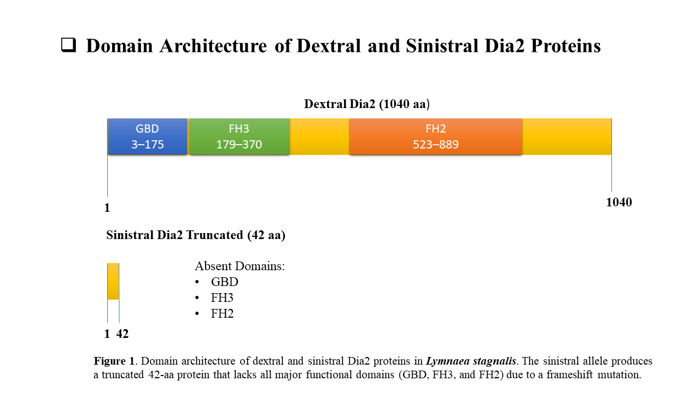
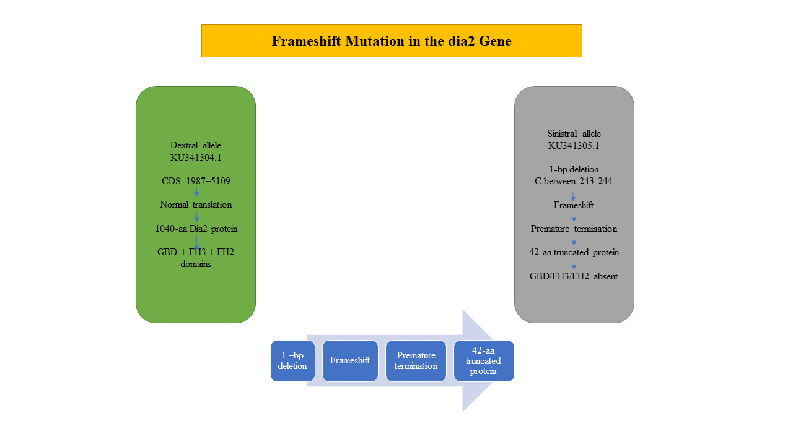

# Comparative Analysis of Dia2 Alleles

## 1. Overview

This project compares the dextral and sinistral alleles of the dia2 gene in *Lymnaea stagnalis*.

The analysis focuses on the differences between the two alleles at the nucleotide and protein levels, with particular attention to the frameshift mutation found in the sinistral allele and its effect on the Dia2 protein.

## 2. Sequence Information

Two Dia2 mRNA sequences were used in this analysis:

| Allele | Accession | Description |
|---|---|---|
| Dextral | KU341304.1 | Full-length dia2 mRNA |
| Sinistral | KU341305.1 | Truncated dia2 mRNA |

Both sequences were obtained from the NCBI GenBank database.

The dextral sequence is 6293 bp long and contains a CDS from 1987 to 5109. The CDS encodes a 1040-aa diaphanous-related formin protein (ALX18036.1).

The sinistral sequence is 4548 bp long. Its CDS extends from 190 to 318 and encodes a 42-aa truncated protein (ALX18037.1).

## 3. BLAST Analysis

BLAST was used to compare the nucleotide sequence with sequences available in the NCBI database.

The dextral Dia2 sequence (KU341304.1) showed a 100% query coverage and 100% sequence identity with the corresponding *Lymnaea stagnalis* Dia2 reference sequence.

The sinistral sequence (KU341305.1) also showed a strong match with the corresponding Dia2 sequence, with approximately 70% query coverage and 99.22% sequence identity.

The BLAST results also showed similarity with related diaphanous-related formin sequences from other *Lymnaea* and snail species.

## 4. Frameshift Mutation in the Sinistral Allele

The GenBank annotation of KU341305.1 identifies a one-base-pair deletion at position 243-244.

The deleted base is reported as cytosine (C).

This deletion changes the reading frame of the CDS.

The resulting frameshift leads to premature termination and produces a highly truncated Dia2 protein containing only 42 amino acids.

In contrast, the dextral allele contains a complete CDS that produces a 1040-aa Dia2 protein.

## 5. Protein Comparison

The dextral Dia2 protein (ALX18036.1) is 1040 amino acids long.

The annotated functional regions include:

- GBD: amino acids 3–175
- FH3: amino acids 179–370
- FH2: amino acids 523–889

The sinistral Dia2 protein (ALX18037.1) contains only 42 amino acids.

Because of the severe truncation, the major annotated GBD, FH3, and FH2 regions present in the dextral protein are absent from the sinistral protein.

## 6. Domain Architecture

The domain architecture of the two Dia2 proteins was visualized using the annotated domain coordinates from the GenBank record.

The dextral protein contains the three major annotated regions:

**GBD → FH3 → FH2**

The sinistral protein is only 42 amino acids long and does not contain these annotated regions.

The domain architecture is shown in:

`figures/domain_architecture_dia2.png`

## 7. Biological Interpretation

The sequence and protein annotations show a clear difference between the two Dia2 alleles.

The dextral allele produces a full-length Dia2 protein containing the major annotated functional domains.

The sinistral allele contains a one-base-pair deletion that causes a frameshift and results in a 42-aa truncated protein lacking the major annotated domains.

This provides a possible molecular explanation for the functional difference between the two alleles.

However, this sequence-based analysis alone does not demonstrate the exact cellular mechanism by which the altered Dia2 protein affects shell coiling. Experimental studies would be required to establish that mechanism.

## 8. Figures

### Figure 1. Dia2 protein domain architecture

The domain architecture of the dextral and sinistral Dia2 proteins is shown in:

### Figure 2. Frameshift mutation

The proposed consequence of the one-base-pair deletion in the sinistral allele is shown in:

## 9. Limitations

This is a small sequence-based bioinformatics analysis.

The analysis is based mainly on publicly available sequence annotations, BLAST results, and annotated protein domains.

The results are consistent with a relationship between the sinistral allele, the frameshift mutation, and the truncated Dia2 protein. However, further experimental and computational analyses would be needed to determine the functional consequences of the mutation in detail.

## 10. Data Sources

- NCBI GenBank
- KU341304.1
- KU341305.1
- ALX18036.1
- ALX18037.1
